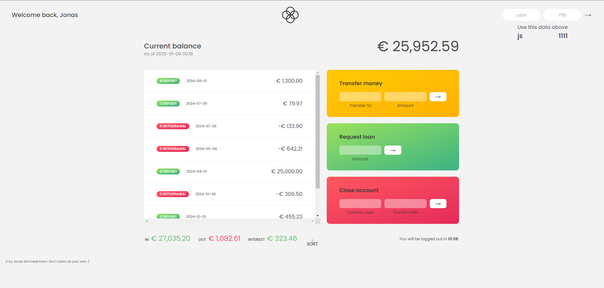

# Bankist: Modern Banking Application

Here you can see website: [Live Demo](https://nbaankist.netlify.app/)


## Project Description
Bankist is a modern, single-page banking application designed to showcase streamlined financial services. The project includes interactive features such as fake user authentication, account management, and dynamic transactions. Bankist provides a seamless and intuitive user experience with a focus on simplicity and performance.

---

## Features
- **Fake User Authentication**: Login functionality for access.
- **Account Overview**: Display of account balance and transaction history.
- **Fund Transfers**: Ability to send money between accounts.
- **Loan Requests**: Request loans with a simplified approval process.
- **Close Account**: Option to delete user accounts securely.
  
---

## Technologies Used
- **HTML5**: For structuring content.
- **CSS3**: For styling and responsive layouts.
- **JavaScript**: For dynamic interactions and functionality.
- **Netlify**: For hosting and deployment.

---

## Setup Instructions
To run this project locally, follow these steps:

1. Clone the repository:
   ```bash
   git clone https://github.com/AndNijaz/bankist.git
   ```

2. Navigate to the project directory:
   ```bash
   cd bankist
   ```

3. Open `index.html` in your browser to view the application.

---

## Usage
The application is designed for:
- **Demo Purposes**: Showcasing core banking functionalities.
- **User Interactions**: Experimenting with login, transfers, and account management.
- **Developers**: Exploring the implementation of modern JavaScript features.

---

## Screenshots

### Account Overview


> *Screenshots are stored in the `/img` directory.*

---

## Project Status
This project is **complete**. Future updates may include:
- Adding a backend for persistent data storage.
- Expanding user authentication to support multi-factor login.
- Integrating additional financial tools such as savings calculators.

---

## Acknowledgements
This project is inspired by modern banking applications and was developed to demonstrate essential financial application features. Special thanks to resources and tutorials that supported this development.

---


